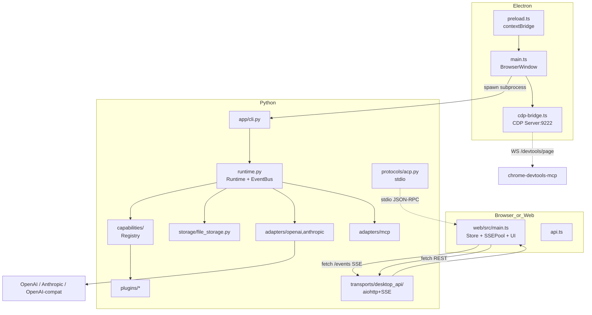

# ziva 全栈代码分析报告

> 范围:`/Users/wangxinxin/code/ziva`(Python 后端 + Electron 桌面 + Web 前端 + 插件系统 + 测试)。
> 不复述 `code_analysis.md` / `code_analysis_report.md`,做独立的全栈视角。

---

## 1. 项目概览

`ziva` 是一个 Codex-like 的多端 AI 编程 Agent 运行时。Python 后端(`src/ziva_runtime`)提供统一的 extension API(`prompt/tool/skill/hook/memory`)与 ACP/HTTP 协议面,Electron 桌面端(`electron/`)将后端打包成原生应用并通过自研 CDP Bridge 接入 `chrome-devtools-mcp`,Web 前端(`web/`)既可独立运行也可作为 Electron 内部 UI,插件系统(`plugins/`)以 `manifest.yaml + impl.py` 形式热加载扩展能力,会话、消息、压缩产物均以 JSONL 持久化到 `~/.ziva/sessions/<pid>/`。

**技术栈**:`pyyaml` · `aiohttp` · `rich` · `prompt_toolkit` · `openai` · `anthropic` · `mcp` · Electron 35 · TypeScript 5.5 · Vite 5.4 · `xterm.js` · `prismjs` · `marked` · `katex` · `electron-builder` · `pyinstaller`。

**顶层目录树**:

```text
ziva/
├── src/ziva_runtime/
│   ├── adapters/{openai,anthropic,mcp,retry}.py
│   ├── app/{cli,display}.py            # CLI 入口
│   ├── capabilities/                    # Plugin Protocol/Registry/EventBus
│   ├── config/{loader,instructions}.py  # YAML 合并与校验
│   ├── permissions/{manager,wildcard}.py
│   ├── plugins/{loader,manifest}.py
│   ├── protocols/acp.py                 # JSON-RPC over stdio
│   ├── session/compaction.py
│   ├── shared_types.py                  # 全部 dataclass
│   ├── storage/file_storage.py          # JSONL + fcntl 文件锁
│   ├── transports/desktop_api/server.py # aiohttp HTTP+SSE
│   └── runtime.py                       # 核心 1800 行的模型/工具循环
├── electron/{main,preload,cdp-bridge}.ts
├── web/src/{main,api,sse,state,markdown}.ts
├── plugins/{tools,hooks,memory,prompts}/*/manifest.yaml + impl.py
├── tests/                              # 50+ pytest
├── pyproject.toml · README.md · uv.lock
└── electron/{package.json,tsconfig.json,ziva-backend.spec}
```

---

## 2. 架构与数据流

### 2.1 组件关系



### 2.2 Prompt → 模型 → 工具 → 前端 的数据流

`web/src/main.ts` 监听 `Enter` 调 `sendComposerMessage(sid)`,封成 `ChatMessage(role="user", content=[text|image_url])` POST `/sessions/{sid}/turns`(`web/src/main.ts:1287`)。
桌面 server `create_turn` 起 `asyncio.create_task(runner())`(`transports/desktop_api/server.py:548`),通过 `Runtime.chat_with_events` 拉起 `_run_model_tool_loop`(`runtime.py:885`)。

每轮循环:
1. 拼装 `effective_prompt = base_prompt + instructions + env_context + skill_index`(`runtime.py:990-1004`)。
2. 模型 adapter 流式产出 `StreamDelta`,`runtime._emit` 同时写入 `EventBus` 队列 + `EventBus._history` + 事件总线(`runtime.py:1323-1329`)。
3. `delta` 事件、SSE 全局流 `/events` 推送到前端 `SSEPool`(`web/src/sse.ts`),`handleSessionEvent` 按 `session_id` 路由到对应 pane 渲染。
4. 若含 `tool_calls`,并行 `asyncio.gather` 执行工具,产出 `tool_start` / `tool_end`,然后下一轮模型调用。
5. 完成时 `turn_end`,`FileStorage.append_message` 把每条消息追加到 `<sid>.jsonl`,并发写 `last_usage`(`runtime.py:1741-1769`)。

### 2.3 Electron ↔ Backend 启动流

`electron/main.ts:14-35` 区分 dev / packaged 两种启动方式;dev 走 `python3 -m ziva_runtime`,packaged 走 PyInstaller 产物。`cdp-bridge.ts:121-133` 启动一个 `9222` 的 CDP Server,把 `BrowserWindow` 的 `webContents` 注册成 Target,`chrome-devtools-mcp --browser-url=http://127.0.0.1:9222` 即可接入,但默认不暴露主 UI(`main.ts:117-120` 注释明示这是设计选择)。

---

## 3. 各模块详解

### 3.1 后端核心 `runtime.py` (1800 行)

入口 `Runtime.create`(`runtime.py:603-642`):加载全局 `~/.ziva/config.yaml` → 扫描 `plugin.paths` 与 `skill.extra_paths` → 构建 `CapabilityRegistry` 与 `EventBus` → 注入 `PermissionManager`。
关键方法:

| 方法 | 行号 | 职责 |
| --- | --- | --- |
| `chat` | 644 | 同步入口(CLI/REPL/turns 任务) |
| `chat_streaming` | 782 | SSE 增量事件流;含 `_is_retryable_provider_error` 重试一次 + `stream_reset` 提示 UI 丢弃中间块 |
| `_run_model_tool_loop` | 885 | 模型↔工具循环,`_apply_prompt` 注入系统提示,`_connect_mcp_if_needed` 懒连 MCP |
| `_execute_tool` | 1385 | permission gate → hook before/after → `asyncio.wait_for` 限速(默认 120s,`spawn_agent/ask_user/get_agent_result` 豁免) |
| `_sanitize_orphaned_tool_calls` | 1649 | 修复 Anthropic 400 报错的"无 result 的 tool_use"(取消/崩溃场景) |
| `_resolve_image_paths` | 206 | 视 vision-capable 把本地路径改写成 base64 data URL,非视觉模型改写为文本引用,杜绝"路径泄露到 provider" |
| `update_session_usage` | 1771 | 持久化 `last_usage.prompt_tokens`,作为自动 compact 的触发信号 |

设计评价:把"取消-回放一致性"和"视觉/非视觉模型差异化"处理得相当扎实;但单文件 1800 行,职责过重,见 §6。

### 3.2 协议层 `protocols/acp.py` + `runtime.py:644-781`

JSON-RPC 2.0 over stdio。`ACPServer.handle`(`acp.py:24-52`)分发 7 个方法,统一 `_ok` / `_err` 输出,`error.data.classification` 是显式字段,便于客户端做策略。
流变体:`chat_stream` 全量事件回放、`chat_stream_chunks` 把 `model_response` 切成 `word`/`char` 粒度的 `delta` chunks、`chat_stream_open/_next` 支持分页拉取避免一次性大返回(`acp.py:91-129`)。`serve_stdio`(`acp.py:207-227`)是 `asyncio.to_thread(sys.stdin.readline)` 串行循环。

### 3.3 桌面 HTTP `transports/desktop_api/server.py` (1939 行)

aiohttp 单进程,53 条路由。按功能分四组:

- **会话 / 消息**:`/sessions`(GET/POST/DELETE/PATCH)、`/sessions/{sid}/turns`(GET/POST)、`/sessions/{sid}/messages`、`/sessions/{sid}/compact`、`/sessions/{sid}/prune`、`/sessions/{sid}/cancel`、`/sessions/{sid}/attachments`、`/attachments`(GET 代理)。
- **实时流**:`/events`(全局广播,推荐)、`/sessions/{sid}/events`(遗留 per-session SSE)。
- **配置 / 状态**:`/config`(GET/PATCH,JSON)、`/config/yaml` / `config/json`、 `/status`、`/mcp-status`、`/skills`、`/automations`。
- **面板 / 桌面**:`/api/files/tree`、`/api/files/read`、`/api/proxy`(URL 代理,HTML 注入 `<base>`)、`/ws/terminal`(PTY)、`/api/stt`(mlx-whisper 离线转写)。

`Automation` 数据类(32-69 行)持久化在 `~/.ziva/automations/<pid>.json`,`schedule_time` 支持每日定点执行,`_run_automation_once` 直接 `runtime.chat` 然后写回 `last_result` / `last_error`。

`/sessions/{sid}/turns` 任务包装是设计重点:`create_turn` 把 `runner` 闭包丢给 `asyncio.create_task`,`cancel_turn` 取消 task + 调 `cancel_token.cancel` + `cancel_all_questions`(`server.py:1238-1250`)。`task.cancel()` 之后 `runner` 的 `finally` 块会做 *identity check* `if s.cancel_token is token` 才清零,避免误清掉新 turn 的 token(`server.py:541-547`)。

### 3.4 模型适配器 `adapters/{openai,anthropic}/`

- `OpenAIChatAdapter.chat_stream`(`adapters/openai/provider.py:236-353`):流式读取,`tool_calls_acc` 按 `index` 累积,`finish_reason == "tool_calls"` 时一次性产出 `final_tool_calls`。内置 `_ThinkTagParser`(`provider.py:49-117`)把 `<think>…</think>` 与 `<mm:think>…</mm:think>` 标签从 `content` 切到 `reasoning_content`,覆盖 MiniMax、DeepSeek 等用 inline tag 模拟推理的 provider。`o1`/`o3` 走 `reasoning_effort`,其余通过 `extra_body` 透传 provider-specific options。
- `AnthropicChatAdapter`(`adapters/anthropic/provider.py:222-335`):把 `ChatMessage` 装到 Anthropic content blocks,`thinking` block 只在有 `signature` 时回传(无签名会触发 400),`tool_use_id` 映射到 `tool_result`。`message_start` / `content_block_*` / `message_delta` 三类事件完整解析。

两个 adapter 都包了一层 `call_with_retry`(`adapters/retry.py`):指数退避 0.5s→10s,`MAX_RETRIES=2`,429/5xx 重试,且尊重 `Retry-After` 头;额外识别 content-level 的 `1027` / `input_sensitive` 标记。

### 3.5 能力注册 `capabilities/`

```python
class Tool(Protocol):
    def spec(self) -> Dict[str, Any]: ...
    async def run(self, input_data, ctx) -> ToolResult: ...
```

`CapabilityRegistry`(`capabilities/registries.py`)只做 KV 存储,`list_kind("tool")` 是主查询路径。`EventBus`(`capabilities/events.py`)支持 per-session 队列 + `subscribe_global` 单一广播队列(前端 SSE 全局流的实现关键)。

### 3.6 插件系统 `plugins/` + `src/ziva_runtime/plugins/`

目录约定 `plugins/{tools,hooks,memory,prompts,skills}/<id>/manifest.yaml + impl.py`。`loader.py:11-17` 的 `TYPE_DIRS` 映射 5 类;`manifest.py:25-62` 强制 `id` 含 `.`、`entry` 必须 `module:Symbol`、类型在 5 元白名单。`loader.py:48-73` 处理启停:memory 后端只启名字等于 `config.memory.backend` 的,tool 类需要 `config.tools.<id>.enabled`;否则仅看 `enabled_by_default`。

实际产品插件数(13 tool + 4 hook + 2 memory + 0 prompt + N skill):
- tool: `shell`、`read_file`、`write_file`、`edit_file`、`glob`、`grep`、`list`、`web_fetch`、`ask_user`、`spawn_agent`、`get_agent_result`、`cancel_agent`、`manage_scheduled_tasks`、`update_plan`、`read_skill`。
- hook: `file_guard`(turn 开头给带 image 的消息追加 "你已经看到了" 提示)、`plan_reminder`、`truncation`、`doom_loop`。
- memory: `inmemory`、`markdown`(YAML frontmatter + body,按 key 全量搜索)。

### 3.7 前端 `web/src/`

- `state.ts`:`Store<T>` 简单发布订阅,带细粒度 `runningSessions[sid]` / `pendingMessages[sid]` / `promptDrafts[sid]`(命名都是显式的 `sid-keyed`,替代了 active/background 的双重状态)。
- `sse.ts:22-163`:`SSEPool` 全局单连接,`reader.read()` + `TextDecoder` 拆 `data:` 行,指数退避重连,`MAX_RETRIES=50` 后进入 `permanentlyDisconnected`。
- `api.ts`:30s `AbortController` timeout,统一 `{ error, message }` 错误结构。
- `main.ts`:2000+ 行的 monolith,分成 4 个主要子系统:sidebar+sessions、split-pane 管理、composer(单一模板 + `data-sid` 委托)、right panel(5 种 tab:review/plan/terminal/browser/files)。`data-sid` 委托的 `document.addEventListener` 模式(`main.ts:1238-1371`)消除了 per-pane handler。

### 3.8 Electron `electron/`

- `main.ts` 191 行,简洁。spawn Python + 创建窗口 + 起 CDP bridge。
- `preload.ts` 14 行,只暴露 5 个 IPC:`getBackendUrl` / `isElectron` / `getCdpPort` / `registerCdpPage` / `unregisterCdpPage`。
- `cdp-bridge.ts` 624 行,**这是 ziva 区别于普通 Electron 应用的亮点**:自己实现 CDP Server,支持 `/json/version`、`/json/list`、`/devtools/browser` WS、`/devtools/page/<id>` direct WS、`Target.getTargets` / `attachToTarget` / `sendMessageToTarget`(`cdp-bridge.ts:335-478`),`flatten: true` 与 legacy 两种响应形态都支持,这样 `chrome-devtools-mcp` 可以只接 Ziva 内嵌的 Agent Browser 标签,主 UI 不被工具看到。

---

## 4. 接口与协议

### 4.1 ACP 方法表

| 方法 | 行号 | 入参 | 返回 |
| --- | --- | --- | --- |
| `initialize` | `acp.py:29` | `{}` | `{name, version, capabilities:{chat,tools,stream}}` |
| `ping` | `acp.py:38` | `{}` | `{pong: true}` |
| `tools/list` | `acp.py:40` | `{}` | `{tools: [spec]}` |
| `chat` | `acp.py:54` | `{messages, session_id?}` | `{message, model, usage, finish_reason}` |
| `chat_stream` | `acp.py:70` | 同上 | `{session_id, events: [...], final}` |
| `chat_stream_chunks` | `acp.py:91` | 同上 + `token_granularity?` | `{session_id, chunks: [delta|tool_start|tool_end|final]}` |
| `chat_stream_open` | `acp.py:100` | 同上 | `{stream_id, session_id, size}` |
| `chat_stream_next` | `acp.py:110` | `{stream_id}` | `{done, chunk}` |

### 4.2 Tool call 协议

- **Preferred**(`README.md:28`):`[[TOOL_CALL]]{"name":"echo","arguments":{"text":"hello"}}[[/TOOL_CALL]]`
- **Backward-compat**:`TOOL_CALL echo {"text":"hello"}`

但内部运行时 *不* 解析文本里的 marker —— 模型直接通过 OpenAI/Anthropic 的原生 function calling 协议产出 `tool_calls`(`adapters/openai/provider.py:312-335`、`adapters/anthropic/provider.py:71-79`)。文本 marker 协议只用于外部(可读)日志与测试用例。

### 4.3 HTTP 端点摘要

按方法分(完整路由见 `server.py:175-235`):

- **会话**:`GET/POST /sessions`、`PATCH/DELETE /sessions/{sid}`、`GET /sessions/{sid}/messages?include_dropped=true`、`GET/POST /sessions/{sid}/turns`、`POST /sessions/{sid}/compact`、`POST /sessions/{sid}/prune`、`POST /sessions/{sid}/cancel`、`POST /sessions/{sid}/attachments`、`GET /attachments?path=…`、`POST /sessions/{sid}/revert`、`POST /sessions/{sid}/git-checkout`、`GET /sessions/{sid}/git-branches`、`GET /sessions/{sid}/plan`、`GET /sessions/{sid}/diff`、`GET /sessions/{sid}/tools`。
- **流**:`GET /events`(全局 SSE)、`GET /sessions/{sid}/events`(legacy)。
- **资源**:`GET/POST /automations` / `GET/POST /automations/{aid}/run` / `PATCH/DELETE /automations/{aid}`。
- **交互**:`POST /api/permissions/{request_id}/reply`、`POST /sessions/{sid}/questions/reply`、`GET /api/system/choose-folder`、`GET /api/workspace/recent`、`POST /api/workspace/switch`、`POST /api/workspace/remove`、`POST /api/workspace/git-checkout`、`GET /api/workspace/git-branches`。
- **面板**:`GET /api/files/tree?depth=2`、`GET /api/files/read?path=…&binary=1`、`GET /ws/terminal`、`GET /api/proxy?url=…`、`POST /api/stt`。
- **配置**:`GET /status`、`GET /mcp-status`、`GET/PATCH /config`、`GET /config/yaml`(PUT 保存 raw)、`GET/PUT /config/json`、`GET /skills`、`GET /skills/file?path=…`、`GET /api/agents`、`GET /api/agents/{agent_id}`、`POST /api/agents/{agent_id}/cancel`。

### 4.4 错误结构

ACP(`acp.py:193-204`):

```json
{"jsonrpc": "2.0", "id": 1, "error": {"code": -32602, "message": "…", "data": {"classification": "invalid_params"}}}
```

HTTP 工具调用错误统一为 `ToolResult(text="Error: <code>\\n<message>", error=True, metadata=...)`,例如 `Error: tool_not_found` / `permission_denied` / `timeout` / `mcp_unavailable` / `mcp_not_connected` / `recursive_forbidden` / `mcp_call_failed`(`adapters/mcp/client.py:84-100`)。
HTTP 错误响应 `{"error": "session_not_found", "message": "…"}` + 4xx 状态码,前端 `api.ts:73-79` 解包成 `Error & {error, status}`。

### 4.5 MCP 连接生命周期

`MCPConnectStatus`(`shared_types.py:12-34`)取代了过去的 boolean:5 个状态 `DISCONNECTED` / `CONNECTING` / `CONNECTED` / `NO_CONFIG` / `FAILED`。`runtime._connect_mcp_if_needed`(`runtime.py:1237-1296`)只在 `CONNECTED` 时 short-circuit,`FAILED` / `NO_CONFIG` 都允许下轮重试 —— 这避免了"一次失败永久跳过"的死锁。

---

## 5. 扩展点

### 5.1 YAML 配置层级

合并顺序:`DEFAULT_CONFIG`(`config/loader.py:9-54`)→ `~/.ziva/config.yaml` → `session_override`(CLI `--model/--approval/--max-rounds` 注入)。
校验走 `validate_config`(`config/loader.py:83-227`):必填顶层段、`model.thinking_budget_tokens < model.max_tokens`、`providers[].capabilities` 仅 `thinking/vision/tools` 三键、`agents.<name>.hooks` 白名单 `before_turn/after_turn/before_tool/after_tool`。
**Workspace-local config 不被读取**(`config/loader.py:233-237` 显式注释),这是产品决策,但 `.ziva/AGENTS.md` 仍然按 workspace 加载(`config/instructions.py:10-13`)。

### 5.2 Plugin manifest 字段

```yaml
id: tool.shell             # 必填,需含 "."
type: tool                 # tool|skill|hook|memory|prompt
version: 0.1.0
entry: impl.py:ShellTool    # "module.py:Symbol"
permissions:               # 决定 _execute_tool 的 gate
  shell: [execute]
enabled_by_default: true
config: {…}                # 透传到 impl 初始化
```

### 5.3 Extension API

| 类别 | 协议 | 触发 |
| --- | --- | --- |
| `prompt` | `render(template, vars, ctx) -> str` | 每个 turn 注入 system prompt |
| `tool` | `spec()` + `async run(input, ctx) -> ToolResult` | 模型 function call |
| `skill` | `match(input_text, ctx) -> bool` + `async execute(input, ctx)` | `_maybe_apply_skill` 命中即替换 user message |
| `hook` | `event_name: "before_turn"` / `after_turn` / `before_tool` / `after_tool` + `matcher` + `async handle(payload, ctx) -> payload` | `_run_hooks` 串行调用,可改 payload |
| `memory` | `async put/search/summarize` | `_store_memory` 写 `last_turn` |

子代理(`plugins/tools/spawn_agent`):`child_meta["_subagent"]=True` 触发 `_parent_only` 黑名单(`spawn_agent`/`get_agent_result`/`cancel_agent`),`agents.<name>.hooks` 控制子代理接收的 hook 事件子集,`agents.<name>.memory = "inherited" | "none"` 控制是否写 memory。

---

## 6. 问题与改进建议

### 6.1 健壮性 / Bug 风险

1. **Adapter 缓存永不失效**(`runtime.py:42` 的 `_ADAPTER_REGISTRY` 是模块级 dict,只通过测试 helper `_reset_adapter_registry` 清空)。`save_config_json` 写完磁盘只 `self.runtime.config = merged`(`server.py:1455`),*不*清缓存 —— 改 `providers[0].base_url` 后已起好的 session 仍走旧 URL,直到进程重启。

2. **重试不撤回已落盘消息**(`runtime.py:850-879` 的 `chat_streaming` 重试循环):注释说 "disk / history are NOT touched" 但 `_run_model_tool_loop` 在流式 *过程中* 已经可能调过 `_persist_message`(`runtime.py:1116,1126,1157,1201`)。第二次 attempt 会重放整段 history 给模型,tool results 重复。这条 `stream_reset` 路径需要审计 *第一次 attempt 中哪些行真的可能写入*。

3. **MCP stdio cleanup 用全局异常 handler 静默**(`app/cli.py:427-449`):`_suppress_anyio_cancel_scope` 注册 `loop.set_exception_handler` 吞掉所有 "cancel scope" 错误。如果其他不相关模块也用 anyio,问题会被掩盖;同时 `serve_stdio` 之外的 ACP caller 拿不到这个保护。

4. **`compile_messages` 失败时静默回退**(`session/compaction.py:289-296`):`CompactAgent.run` 抛异常或返回空字符串时,只调用 `_simple_compact_split` 做"前 200 字符拼接"截断式摘要,然后继续。一个失败的 compact 会让用户的多轮上下文悄悄退化,但 UI 看到的是正常的 `context_compacted` 事件。

5. **自动化并发没有边界**:`Automation` 创建后 `asyncio.create_task(self._automation_runner)`(`server.py:295`)独占 task,但多个 automation 同时触发都会进 `runtime.chat`,没有总并发限制。`spawn.max_concurrency=20` 只约束 *background sub-agents*,不约束 automations。

6. **`PermissionManager.reply` 锁粒度不对**(`permissions/manager.py:199-265`):`reply` 是 *同步* 函数(被 aiohttp 同步 handler 直接调),而 `ask` 持 `self._lock` 异步。`state["pending"]` 在 reply 路径上 *不* 加锁 —— 多个 HTTP handler 并发 reply 时可能 race;同时 reject 路径上 `state["pending"].items()` 列表在迭代中 pop,虽然复制了 `list(...)` 但 state 本身的引用是共享 dict。

7. **`server.py:202` 的 "started" 启发式**:`main.ts:48-65` 等子进程输出包含 "Running on" 或 "started" 才 resolve,但 aiohttp 默认日志没有这些 token,实际依赖 5s `setTimeout` 兜底(`main.ts:78-83`)。冷启动慢/启动信息不一致时窗口期会出现"前端 fetch 502"。

### 6.2 错误处理缺失

1. **`web_fetch` 工具无 SSRF 防护**(`plugins/tools/web_fetch/impl.py:44-50`):允许 `http://` / `https://`,但 `127.0.0.1`、`10.0.0.0/8`、`169.254.0.0/16`、`file://` 等内网 / 文件 scheme 都没拦截。模型在沙箱未启用时(`approval=suggest` + `web_fetch` 命中 `auto-approve`)可直接打后端 4097 端口。
2. **`/api/proxy` 同问题**(`server.py:1807-1835`):接收任意 URL 后用 aiohttp 抓回 HTML 注入 `<base>`,无内网 IP 过滤。配合 `localhost:4097` 上的 `/config/yaml`、`/skills/file` 端点即可读全局配置。
3. **`/sessions/{sid}/revert` 用 `shlex.quote` 但仍在 `cwd=workspace` 下 `git checkout -- {file}`**(`server.py:1294-1305`):如果 `files` 列表里含参数(例如含空格)会被 quote,但含 `--upload-pack=` 的恶意路径仍会传给 git —— 模型可控 input + 无 allowlist = RCE 风险。建议加入 `Path(files).resolve().relative_to(workspace_root)` 校验。
4. **`/sessions/{sid}` DELETE/PATCH 接受任意 `workspace` 字段**(`server.py:1200-1216, 1261-1267`):`target_pid = _project_hash(Path(ws))`,用户可以指定 `/etc/ziva-sessions` 之外的任何目录,这会创建新项目 ID 然后删除;但因为 `_project_hash` 是 `sha256(path)[:16]`,任何含恶意 workspace 路径都能进入目标项目目录。应当校验 workspace 必须在 `_read_recent_workspaces` 白名单内。
5. **`MarkdownMemoryStore.put` 用 `f"key: {json.dumps(key)}"`**(`plugins/memory/markdown/impl.py:29`):YAML frontmatter 是手拼的字符串,如果 key 包含 `"` 或换行,生成的 `.md` 文件不合法;`search` 阶段 `read_text` 抛异常。建议用 `yaml.safe_dump`。
6. **`proxy_url` 在非 HTML 时 `content_type.split(";")[0]`**(`server.py:1833`):如果上游返回 `text/html; charset=utf-8; application/json`(恶意),后端会按 HTML 注入 base,把 JSON 搞坏。
7. **`/ws/terminal` 无认证 + 任意用户 home**(`server.py:1728-1805`):端口只绑 `127.0.0.1`,但 `get_status` 暴露在同端口;`choose_folder` macOS-only 走 osascript,如果进程被远程 SSRF 触发(见 §6.2.1),终端 PTY 可被操控。
8. **`_run_model_tool_loop` 取消路径的 `tool_result` 注入**(`runtime.py:1146-1158`):`asyncio.gather` 抛 `CancelledError` 时,为每个 tool_call append 一条 `[cancelled]` 消息;但这发生在 `try:` 的 `except asyncio.CancelledError:` 块里 *之前* 没有任何清理 hook 通知下游;如果 tool 是 `write_file` 写了半截,文件状态可能不一致。应当区分 "tool 已经完成写入但 gather 还未回" vs "tool 被中断"。

### 6.3 测试盲区

1. **无前端测试**:`web/package.json` 没有 Vitest/Jest,`main.ts` 2000+ 行没有覆盖。SSEPool 的指数退避、`renderSplitPanes` 的 active/secondary 切换、composer 委托事件都没有单测。
2. **Permission race conditions 未测**:`tests/test_permission_gate.py`(从名字看)只覆盖了 happy path。`reply` 的非加锁路径、`evaluate` 的 reverse-merge 顺序没有并发测试。
3. **MCP 客户端的生命周期**:`tests/test_mcp_client.py` 与 `test_mcp_enum_lifecycle.py` 存在,但是否覆盖了 `MCPConnectStatus` 5 状态间的迁移 + `cleanup` 失败时的回退,需要核对。
4. **Adapter 缓存**:`_ADAPTER_REGISTRY` 跨 test 污染的解决是 `_reset_adapter_registry`,但生产路径(配置变更后缓存未清)没有 e2e 覆盖。
5. **JSONL 并发写入**:`fcntl.flock` 是进程内的 advisory lock,**跨进程不生效**;`FileStorage.update_message` 重写整个文件,期间读端 `get_messages` 可能看到空文件。没有跨进程 + 跨 reader/writer 的并发测试。
6. **`/events` 全局 SSE 在大 session 数下的表现**:`SSEPool` 注释里说"之前 N 个 session 跑 N 个 reader loop 会让浏览器卡死",但新实现是否真在 50+ session 下依然顺滑没有基准。
7. **没有 Playwright/Cypress e2e**:全栈交互(create session → send → 取消 → 切换 workspace)只能手动验证。

### 6.4 性能 / 资源

1. **EventBus `_history` 用 `deque(maxlen=500)` 但 `runtime.event_seq` 单调递增**(`capabilities/events.py:18` + `runtime.py:1323-1326`):超过 500 的事件历史被丢弃,前端 `get_messages` 看到的就是截断版的过去事件;后端 `_emit` 没有 trim `_global_queues` / `_queues` 长期订阅者。
2. **`build_skill_index` 每次 `/skills` 请求都重扫**(`runtime.py:473-513` + `server.py:1580`):`rglob("SKILL.md")` 在 100+ 技能的项目上每次 HTTP 调用都走一遍 FS,无 mtime 缓存。
3. **`build_tools_param` 每次 turn 都重新调 `tool_rec.instance.spec()`**(`runtime.py:1303-1321`):spec 是稳定的纯 dict,应当 LRU。
4. **`_resolve_image_paths` 的 `copy.copy(msg)` 对每个变动的 message 都做一次**(`runtime.py:377`):多图对话会复制整条消息。
5. **Adapter client `AsyncOpenAI(timeout=120.0)` 硬编码**(`adapters/openai/provider.py:167` + Anthropic 同):长任务 + STT + WebFetch 同时跑时,共享同一个长 timeout 的连接池。
6. **JSONL 全量重写 `replace_messages`**(`storage/file_storage.py:202-211`):每条 message 一行无压缩,长会话(>5K 条)压缩时整个文件 rewrite,期间锁住其他 writer。

### 6.5 安全 / 沙箱

1. **YAML 加载只走 `safe_load`**(✓)但**配置文件无 schema 版本号**:`_load_yaml` 不检查 `version` 字段,跨大版本升级时配置可能静默不生效。
2. **`PermissionManager.EDIT_TOOLS` 硬编码**(`permissions/manager.py:109`):`["edit", "write", "patch", "multiedit"]` 是 Codex 时代的工具名,本项目实际工具叫 `edit_file` / `write_file` / `apply_patch`,所以这段分支实际是死代码。
3. **plugin `manifest.id` 用 `.` 分隔但 loader 用 `manifest.id.split` 风格是错的**:`loader.py:58` 用 `manifest.id.replace("tool.", "")` 取 `tools.<id>`,但 tools 的 `config.tools.<id>.enabled` 又是一份独立配置 —— 用户得记得 *两处* 都打开。
4. **`_run_hooks` 不限速、不隔离**(`runtime.py:1627-1638`):一个慢 hook 直接阻塞 turn 循环;权限插件可以读任意文件没有隔离。
5. **CDP bridge 无 origin 校验**(`cdp-bridge.ts:208-243`):只绑 127.0.0.1 + `Access-Control-Allow-Origin: *`,浏览器扩展可访问。

### 6.6 工程性

1. **`runtime.py` 1800 行** 包含:adapter 工厂、能力分发、prompt 拼接、tool 调度、session 持久化、image 处理、timezone、skill 索引、subagent、permission gate …… 拆分到 `runtime/{adapter,engine,prompt_builder,session_io}.py` 后会好测很多。
2. **`web/src/main.ts` 2000+ 行** 类似问题,UI 状态机、Markdown 渲染、sse 路由、composer 委托、分屏逻辑全在一处。
3. **`transports/desktop_api/server.py` 1939 行** 把 HTTP、SSE、WebSocket、PTY、URL 代理、STT、文件 IO、git 集成、权限审批、自动化调度全塞一个文件,行内"按路由定位"也难。
4. **未使用 import**:`adapters/mcp/__init__.py`、`__main__.py`、若干 hook impl 内部的 `dataclass` import 未用,纯 lint 噪声但能看出无 CI pre-commit。
5. **公开 API 表面 vs 实际**:`shared_types.py:13` 的 `PermissionError` / `RejectedError` 在 runtime 中被 `except RejectedError` 单独捕获,但 `PermissionError` 基类本身从未被使用。

---

## 7. 总结

### 优点 Top 3

1. **取消 / 重放一致性做得到位**:`CancellationToken` + `_sanitize_orphaned_tool_calls` + 取消时合成 `tool_result` 消息(`runtime.py:1649-1709`,`1146-1158`),让 Anthropic 严格的 tool_use→tool_result 顺序在用户中途停止 / 进程崩溃后仍能干净回放,这是 Codex 类系统最容易踩坑的角落。
2. **协议层分层清晰、向后兼容**:ACP JSON-RPC、`chat_stream` / `chat_stream_chunks` / `chat_stream_open/next` 三个流变体(`acp.py:70-129`)把"事件驱动"和"分块拉取"两种消费模型都包了,ToolCall 协议双格式(`README.md:25-35`),JSON-RPC 错误带 `classification`,前端 `api.ts` 30s timeout 兜底,整套很 Codex。
3. **Extension API 与 Manifest 校验把"可插拔"做实在了**:`capability/interfaces.py` 是 4 个 `Protocol` 类 + `manifest.py` 的 id/entry/type 强校验,`loader.py` 的 `enabled_by_default` + `config.tools.<id>.enabled` 双层控制,plugin 即便写错也只是注册失败不会让 runtime 崩;`spawn_agent` 还给子代理加了 `_subagent_call_id` 隔离 + `agents.<name>.hooks/memory` 子集控制。

### 风险点 Top 3

1. **Adapter 缓存不失效 + 配置热更新机制不闭环**:`_ADAPTER_REGISTRY` 模块级 dict 永不清理,`save_config_json` 写完磁盘只更新 `runtime.config`,所以改 `base_url` / `api_key` 不会生效(直到进程重启);这是用户能直接撞到的功能性 bug,优先级最高。
2. **SSRF / RCE 链可被自伤**:`web_fetch` / `/api/proxy` / `/sessions/{sid}/revert` 三个端点都接受模型 / 用户的任意 URL/路径,`127.0.0.1:4097` 上的 `/config` / `/skills/file` 完全无防护;`/revert` 把 `git checkout -- {shlex.quote(f)}` 在 `cwd=workspace` 下跑,模型可控的 path 列表如果不被前端 sanitize 就能在 `workspace` 根目录外做有限操作(经 `shlex.quote` 之后只是缓解,不是消除)。
3. **测试覆盖集中在协议层、几乎覆盖不到运行时关键路径**:50+ pytest 大多跑 happy path 的 protocol / config / tool 解析,而最复杂也最易回归的 `_run_model_tool_loop` 取消重试、`chat_streaming` 重试、Permission race、MCP 状态机迁移、跨进程 JSONL 锁、adapter 缓存失效、split-pane active/secondary 切换均无测试;前端 2000 行 monolith 无任何 e2e 或单元测试。后续每次重构 runtime.py / main.ts 都是盲改。
